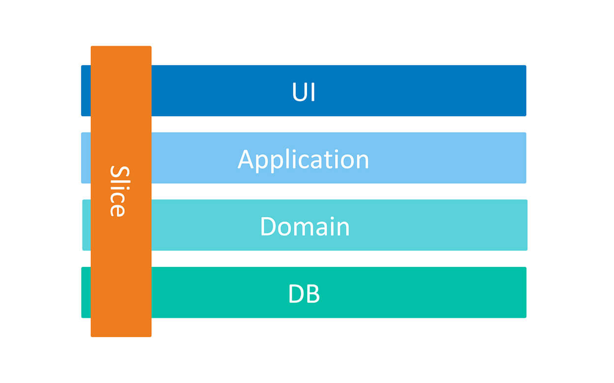

# ECommerce Microservices
> `ECommerce Microservices` is a fictional eCommerce based on different software architecture and technologies like Microservices Architecture, Vertical Slice Architecture, CQRS pattern, Event Sourcing, Domain Driven Design, Event Driven Architecture, Inbox and Outbox Pattern and using Postgres for write side and MongoDb for read side and etc.

This project is still in progress and I update it to the latest technologies continuously.


# Support ⭐
If you like my work, feel free to:

- ⭐ this repository. And we will be happy together :)


Thanks a bunch for supporting me!

[tweet]: https://twitter.com/intent/tweet?url=https://github.com/mehdihadeli/Online-Store-Modular-Monolith&text=Implementing%20an%20online%20store%20Modular%20Monolith%20application%20with%20Domain-Driven%20Design%20and%20CQRS%20in%20.Net%20Core&hashtags=dotnetcore,dotnet,csharp,microservices,netcore,aspnetcore,ddd,cqrs

# Table of Contents

- [The Goals of This Project](#the-goals-of-this-project)
- [Plan](#plan)
- [Technologies - Libraries](#technologies---libraries)
- [The Domain and Bounded Context - Service Boundary](#the-domain-and-bounded-context---service-boundary)
- [Application Architecture](#application-architecture)
- [Application Structure](#application-structure)
- [Prerequisites](#prerequisites)
- [Prerequisites](#prerequisites)
- [How to Run](#how-to-run)
  - [Using Docker-Compose](#using-docker-compose)
  - [Using Kubernetes](#using-kubernetes)
- [Contribution](#contribution)
- [License](#license)

## The Goals of This Project

- The `Microservices Architecture` with `Domain Driven Design (DDD)` implementation.
- Correct separation of bounded contexts for each microservice.
- Communications between bounded contexts through asynchronous `Message Broker` with using `RabbitMQ` with some autonomous services.
- Simple `CQRS` implementation and `Event Driven Architecture` with using Postgres for `Write Side` and MongoDB and Elastic Search for `Read Side`. For syncing Read Side and Write Side I will use [EventStore Projections](https://developers.eventstore.com/server/v5/projections.html#introduction-to-projections) or [Marten Projections](https://martendb.io/events/projections/). we could also sync our Read and Write models with passing some integration event between services for achieving eventually consistency.
- Implementing various type of testing like `Unit Testing`,  `Integration Testing` and `End-To-End Testing`.
- Using [Inbox Pattern](https://event-driven.io/en/outbox_inbox_patterns_and_delivery_guarantees_explained/) for guaranty message [Idempotency](https://www.enterpriseintegrationpatterns.com/patterns/messaging/IdempotentReceiver.html) for receiver microservice and [Exactly-once Delivery](https://www.cloudcomputingpatterns.org/exactly_once_delivery/) pattern and using [Outbox Pattern](https://event-driven.io/en/outbox_inbox_patterns_and_delivery_guarantees_explained/) for ensuring about any message lost and [At-Least one Delivery](https://www.cloudcomputingpatterns.org/at_least_once_delivery/) rule.
- Using `Best Practice` and `New Technologies` and `Design Patterns`.
- Using `Event Storming` for extracting data model and bounded context (using Miro).
- Using Docker-Compose, Helm and Kubernetes for our deployment mechanism and Also using Terraform as infrastructure as a code.
- Using Istio and Service Mesh for our mecroservices

## Plan
> This project is in progress, New features will be added over time.

I will try to register some [Issues](https://github.com/mehdihadeli/e-commerce-microservices/issues) for my `TODO` works, just to not forget and also for tracking my works in future.

High-level plan is represented in the table

| Feature | Status |
| ------- | ------ |
| Building Blocks | Completed ✔️ |
| API Gateway | Completed ✔️ |
| Identity Service | Completed ✔️ |
| Customer Service | Completed ✔️ |
| Catalog Service | Completed ✔️ |
| Order Service |  In Progress 👷‍♂️ |
| Shipping Service | Not Started 🚩 |
| Payment Service | Not Started 🚩 |

## Technologies - Libraries
- ✔️ **[`.NET Core 6`](https://dotnet.microsoft.com/download)** - .NET Framework and .NET Core, including ASP.NET and ASP.NET Core
- ✔️ **[`MVC Versioning API`](https://github.com/microsoft/aspnet-api-versioning)** - Set of libraries which add service API versioning to ASP.NET Web API, OData with ASP.NET Web API, and ASP.NET Core
- ✔️ **[`Npgsql Entity Framework Core Provider`](https://www.npgsql.org/efcore/)** - Npgsql has an Entity Framework (EF) Core provider. It behaves like other EF Core providers (e.g. SQL Server), so the general EF Core docs apply here as well
- ✔️ **[`FluentValidation`](https://github.com/FluentValidation/FluentValidation)** - Popular .NET validation library for building strongly-typed validation rules
- ✔️ **[`Swagger & Swagger UI`](https://github.com/domaindrivendev/Swashbuckle.AspNetCore)** - Swagger tools for documenting API's built on ASP.NET Core
- ✔️ **[`Serilog`](https://github.com/serilog/serilog)** - Simple .NET logging with fully-structured events
- ✔️ **[`Polly`](https://github.com/App-vNext/Polly)** - Polly is a .NET resilience and transient-fault-handling library that allows developers to express policies such as Retry, Circuit Breaker, Timeout, Bulkhead Isolation, and Fallback in a fluent and thread-safe manner
- ✔️ **[`Scrutor`](https://github.com/khellang/Scrutor)** - Assembly scanning and decoration extensions for Microsoft.Extensions.DependencyInjection
- ✔️ **[`Opentelemetry-dotnet`](https://github.com/open-telemetry/opentelemetry-dotnet)** - The OpenTelemetry .NET Client
- ✔️ **[`DuendeSoftware IdentityServer`](https://github.com/DuendeSoftware/IdentityServer)** - The most flexible and standards-compliant OpenID Connect and OAuth 2.x framework for ASP.NET Core
- ✔️ **[`Hangfire`](https://github.com/HangfireIO/Hangfire)** - Easy way to perform fire-and-forget, delayed and recurring tasks inside ASP.NET apps
- ✔️ **[`EasyCaching`](https://github.com/dotnetcore/EasyCaching)** - Open source caching library that contains basic usages and some advanced usages of caching which can help us to handle caching more easier.
- ✔️ **[`AutoMapper`](https://github.com/AutoMapper/AutoMapper)** - Convention-based object-object mapper in .NET.
- ✔️ **[`Hellang.Middleware.ProblemDetails`](https://github.com/khellang/Middleware/tree/master/src/ProblemDetails)** - A middleware for handling exception in .Net Core
- ✔️ **[`IdGen`](https://github.com/RobThree/IdGen)** - Twitter Snowflake-alike ID generator for .Net


## The Domain And Bounded Context - Service Boundary

`ECommerce Microservices` is a simple e-commerce application that has the basic business scenario for online purchasing with some dedicated services. There are six possible `Bounded context` or `Service` for above business:

- `Identity Service`: the Identity Service uses to authenticate and authorize users through a token. Also, this service is responsible for creating users and their corresponding roles and permission with using [.Net Core Identity](https://docs.microsoft.com/en-us/aspnet/core/security/authentication/identity) and Jwt authentication and authorization. I will add also [Identity Server](https://github.com/DuendeSoftware/IdentityServer) in future for this service. Each of `Administrator`, `Customer` and `Supplier` are a `User`, actually a `IdentityUser`. To be a User, User Registration is required. Each User is assigned one or more User Role.
Each User Role has set of Permissions. A Permission defines whether User can invoke a particular action or not.

- `Catalog Service`: The Catalog Service presents the ability to add items to our store, It can be electronics, foods, books or anything else. Items can be grouped into categories and catalogs. A catalog is defined as a list of items that a company showcases online. the catalog is a collection of items, which can be grouped into categories. An item can be assigned to only one category or be direct child of a catalog without any category.
Buyer can browse the products list with supported filtering and sorting by product name and price. customer can see the detail of the product on the product list and in the detail page, can see a name, description, available product in the inventory,...

- `Customers Service`: This service is responsible for managing our customers information, track the activities and subscribing to get notification for out of stock products

- `Order Service`: The Orders Service main purpose is to store order details and manage orders created by users on client side. This service is not designed to be a full order processing system like ERP but serves as storage for customer orders details and can be synchronized with different external processing systems.
Some of this service responsibilities are `Saving orders`, `Saving order drafts`, `Ability to view and manage fulfillment, packages`, `Change discounts`

- `Payment Service`: The payment service is responsible for payment process of our customer with different payment process and managing and tracking our payment history

- `Shipping Service`: The Shipping Service provides the ability to extend shipping provider list with custom providers and also provides an interface and API for managing these shipping providers.
Some of shipping service capabilities are `Register Shipping methods`, `Edit Shipping method`, `Shipment details`, `Shipping settings`

## Application Architecture

The architecture shows that there is one public API (API gateway). This is accessible for the clients. This is done via HTTP request/response.

The API gateway then routes the HTTP request to the correct microservice. The HTTP request is received by the microservice that hosts its own REST API. Each microservice is running within its own domain and has directly access to its own dependencies such as databases, stores, etc. All these dependencies are only accessible for the microservice and not to the outside world. In fact microservices are decoupled from each other. This also means that the microservice does not rely on other parts in the system and can run independently of other services.


Microservices are event based which means they can publish and/or subscribe to any events occurring in the setup. By using this approach for communicating between services, each microservice does not need to know about the other services or handle errors occurred in other microservices.

I this architecture we use [CQRS pattern](https://www.eventstore.com/cqrs-pattern) for separating read and write model beside of other [CQRS advantages](https://youtu.be/dK4Yb6-LxAk?t=1029). Here for now I don't use [Event Sourcing](https://www.eventstore.com/blog/event-sourcing-and-cqrs) for simplicity. we can use ES for syncing read and write sides with using projections, beside of other its usage but In future I will update this project to using Event Sourcing. Here I have a write model that uses a postgres database for handling better consistency and ACID transaction guaranty. beside o this write side I use a read side model that uses MongoDB for better performance of our read side without any joins with suing some nested document in our document also better scalability with some good scaling features of MongoDB.
For syncing our read side and write side we have 2 options:

- If `Our read sides` are in `same service`, during saving data in write side I save a [Internal Command](https://github.com/kgrzybek/modular-monolith-with-ddd#38-internal-processing) record in my `Command Processor` storage (like something we do in outbox pattern) and after commenting write side, our `command processor manager` reads unsent commands and sends them to their `Command Handlers` in same corresponding service and this handlers could save their read models in our MongoDb database as a read side.

- If `Our read sides` are in `another services` we publish an integration event after committing our write side and all of our `Subscribers` could get this event and save it in their read models (MongoDB).

All of this is optional in the application and it is possible to only use what that the service needs. Eg. if the service does not want to Use DDD because of business is very simple and it is mostly `CRUD` we can use `Data Centric` Architecture or If our application is not `Task based` instead of CQRS and separating read side and write side again we can just use a simple `CRUD` based application.

Here I used [Outbox](http://www.kamilgrzybek.com/design/the-outbox-pattern/) for [Guaranteed Delivery](https://www.enterpriseintegrationpatterns.com/patterns/messaging/GuaranteedMessaging.html) and can be used as a landing zone for integration events before they are published to the message broker .

[Outbox pattern](https://event-driven.io/en/outbox_inbox_patterns_and_delivery_guarantees_explained/) ensures that a message was sent (e.g. to a queue) successfully at least once. With this pattern, instead of directly publishing a message to the queue, we store it in the temporary storage (e.g. database table) for preventing missing any message and some retry mechanism in any failure ([At-least-once Delivery](https://www.cloudcomputingpatterns.org/at_least_once_delivery/)). For example When we save data as part of one transaction in our service, we also save messages (Integration Events) that we later want to process in another microservices as part of the same transaction. The list of messages to be processed is called an `OutboxMessages`.
Also we have a background service [OutboxProcessorBackgroundService](src/BuildingBlocks/BuildingBlocks/Messaging/BackgroundServices/OutboxProcessorBackgroundService.cs)  that periodically checks the our outbox messages in the database and try to send the messages to the broker with using our outbox service [EfOutboxService](src/BuildingBlocks/BuildingBlocks/Messaging/Outbox/EF/EfOutboxService.cs). After it gets confirmation of publishing (e.g. ACK from the broker) it marks the message as processed to `avoid resending`.
However, it is possible that we will not be able to mark the message as processed due to communication error, for example `broker` is `unavailable`. In this case our `Outbox Background Service` try to resend the messages that not processed and it is actually [ At-Least-Once delivery](http://www.cloudcomputingpatterns.org/at_least_once_delivery/). We can be sure that message will be sent `once`, but can be sent `multiple times` too! That’s why another name for this approach is Once-Or-More delivery. We should remember this and try to design receivers of our messages as [Idempotents](https://www.enterpriseintegrationpatterns.com/patterns/messaging/IdempotentReceiver.html), which means:

> In Messaging this concepts translates into a message that has the same effect whether it is received once or multiple times. This means that a message can safely be resent without causing any problems even if the receiver receives duplicates of the same message.

For handling [Idempotency](https://www.enterpriseintegrationpatterns.com/patterns/messaging/IdempotentReceiver.html) and [Exactly-once Delivery](https://www.cloudcomputingpatterns.org/exactly_once_delivery/) in receiver side, we could use [Inbox Pattern](https://event-driven.io/en/outbox_inbox_patterns_and_delivery_guarantees_explained/).

In this is a pattern similar to Outbox Pattern. It’s used to handle incoming messages (e.g. from a queue) for `unique processing` of `a single message` only `once` (even with executing multiple time). Accordingly, we have a table in which we’re storing incoming messages. Contrary to outbox pattern, we first save the messages in the database, then we’re returning ACK to queue. If save succeeded, but we didn’t return ACK to queue, then delivery will be retried. That’s why we have at-least-once delivery again. After that, an `inbox background process` runs and will process the inbox messages that not processed yet. also we can prevent executing a message with specific `MessgaeId`multiple times. after executing our inbox message for example with calling our subscribed event handlers we send a ACK to the queue when they succeeded. (Inbox part of the system is in progress, [this issue](https://github.com/mehdihadeli/e-commerce-microservices/issues/7))


Also here I used `RabbitMQ` as my `Message Broker` for my async communication between the microservices with using eventually consistency mechanism. beside of this eventually consistency we have a synchronous call with using `REST` (in future I will use gRpc) for our immediate consistency needs.

We use a `Api Gateway` and here I used [YARP](https://microsoft.github.io/reverse-proxy/articles/getting-started.html) that is microsoft reverse proxy (we could use envoy, traefik, Ocelot, ...), in front of our services, we could also have multiple Api Gateway for reaching [BFF pattern](https://blog.bitsrc.io/bff-pattern-backend-for-frontend-an-introduction-e4fa965128bf). for example one Gateway for mobile apps, One Gateway for web apps and etc.
With using api Gateway our internal microservices are transparent and user can not access them directly and all requests will serve through this Gateway.
Also we could use gateway for load balancing, authentication and authorization, caching ,...

## Application Structure

In this application I used a [Mediator Pattern](https://dotnetcoretutorials.com/2019/04/30/the-mediator-pattern-in-net-core-part-1-whats-a-mediator/) with using [ICommandProcessor](./src/BuildingBlocks/BuildingBlocks/CQRS/Command/ICommandProcessor.cs) and [IQueryProcessor](./src/BuildingBlocks/BuildingBlocks/CQRS/Query/IQueryProcessor.cs) (In top of MediatR library) as mediator gateway for sending command and query to our `handlers`. Also I use these mediators in my controllers for a clean and [Thin Controller](https://codeopinion.com/thin-controllers-cqrs-mediatr/). instead of using and injecting some `Application Service` classes in our controller and depending to different services that breaks single responsibility principle in our controller and a bug bull of mode in our code, we just inject a mediator class which is responsible for routing to corresponding handler for handling logic.

Mediator mediate between objects and prevent direct coupling between objects, and objects could communicate each other with sending some message through mediator as a gateway. Here We use mediator pattern to manage the delivery of messages to handlers. For example in our controllers we create a command and send it to mediator and mediator will route our command to a specific command handler in application layer.

One of the advantages behind the [mediator pattern](https://lostechies.com/jimmybogard/2014/09/09/tackling-cross-cutting-concerns-with-a-mediator-pipeline/) is that it allows us to define some pipelines of activities for requests on top of our mediator for doing some cross cutting concerns that brings [Single Responsibility Principle](https://en.wikipedia.org/wiki/Single_responsibility_principle) and [Don't Repeat Yourself principles](https://en.wikipedia.org/wiki/Don%27t_repeat_yourself) in our application.

For implementing these pipelines in our mediator to handle cross-cutting concerns we use MediatR libraries and its [Pipeline Behaviors](https://github.com/jbogard/MediatR/wiki/Behaviors) or we can create some [MediatR Decorators](https://lostechies.com/jimmybogard/2014/09/09/tackling-cross-cutting-concerns-with-a-mediator-pipeline/) as our pipelines.

Also in this project I used [vertical slice architecture](https://jimmybogard.com/vertical-slice-architecture/) or [Restructuring to a Vertical Slice Architecture](https://codeopinion.com/restructuring-to-a-vertical-slice-architecture/) also I used [feature folder structure](http://www.kamilgrzybek.com/design/feature-folders/) in this project.

- We treat each request as a distinct use case or slice, encapsulating and grouping all concerns from front-end to back.
- When We adding or changing a feature in an application in n-tire architecture, we are typically touching many different "layers" in an application. we are changing the user interface, adding fields to models, modifying validation, and so on. Instead of coupling across a layer, we couple vertically along a slice and each change affects only one slice.
- We `Minimize coupling` `between slices`, and `maximize coupling` `in a slice`.
- With this approach, each of our vertical slices can decide for itself how to best fulfill the request. New features only add code, we're not changing shared code and worrying about side effects. For implementing vertical slice architecture using cqrs pattern is a good match.




Also here I used [CQRS](https://www.eventstore.com/cqrs-pattern) for decompose my features to very small parts that makes our application:

- maximize performance, scalability and simplicity.
- adding new feature to this mechanism is very easy without any breaking change in other part of our codes. New features only add code, we're not changing shared code and worrying about side effects.
- easy to maintain and any changes only affect on one command or query (or a slice) and avoid any breaking changes on other parts
- it gives us better separation of concerns and cross cutting concern (with help of mediatr behavior pipelines) in our code instead of a big service class for doing a lot of things.

With using [CQRS](https://event-driven.io/en/cqrs_facts_and_myths_explained/), our code will be more aligned with [SOLID principles](https://en.wikipedia.org/wiki/SOLID), especially with:

- [Single Responsibility](https://en.wikipedia.org/wiki/Single-responsibility_principle) rule - because logic responsible for a given operation is enclosed in its own type.
- [Open-Closed](https://en.wikipedia.org/wiki/Open%E2%80%93closed_principle) rule - because to add new operation you don’t need to edit any of the existing types, instead you need to add a new file with a new type representing that operation.

We cut each business functionality into some vertical slices, and inner each of this slices we have [technical folders structure](http://www.kamilgrzybek.com/design/feature-folders/) specific to that feature (command, handlers, infrastructure, repository, controllers, ...). In Our CQRS pattern each command/query handler is a separate slice. This is where you can reduce coupling between layers. Each handler can be a separated code unit, even copy/pasted. Thanks to that, we can tune down the specific method to not follow general conventions (e.g. use custom SQL query or even different storage). In a traditional layered architecture, when we change the core generic mechanism in one layer, it can impact all methods.

For checking `validation rules` we use two type of validation:
- [Data Validation](http://www.kamilgrzybek.com/design/rest-api-data-validation/): Data validation verify data items which are coming to our application from external sources and check if theirs values are acceptable but Business rules validation is a more broad concept and more close to how business works and behaves. So it is mainly focused on behavior For implementing data validation I used [FluentValidation](https://github.com/FluentValidation/FluentValidation) library for cleaner validation also better separation of concern in my handlers for preventing mixing validation logic with orchestration logic in my handlers.
- [Business Rules validation](http://www.kamilgrzybek.com/design/domain-model-validation/): I explicitly check all of the our business rules, inner my handlers and I will throw a customized exception based on the error that these errors should inherits from [AppException](./src/BuildingBlocks/BulidingBlocks/Exception/AppException.cs) class, because of these exceptions, occurs in application layer and we catch this exceptions in api layer with using [Hellang.Middleware.ProblemDetails](https://www.nuget.org/packages/Hellang.Middleware.ProblemDetails/) middleware and pass a correct status code to client.

## Prerequisites

1. Install git - [https://git-scm.com/downloads](https://git-scm.com/downloads).
2. Install .NET Core 6.0 - [https://dotnet.microsoft.com/download/dotnet/6.0](https://dotnet.microsoft.com/download/dotnet/6.0).
3. Install Visual Studio 2022, Rider or VSCode.
4. Install docker - [https://docs.docker.com/docker-for-windows/install/](https://docs.docker.com/docker-for-windows/install/).
5. Make sure that you have ~10GB disk space.
6. Clone Project [https://github.com/mehdihadeli/e-commerce-microservices](https://github.com/mehdihadeli/e-commerce-microservices), make sure that's compiling
7. Open [ECommerce.sln](./ECommerce.sln) solution.

## How to Run

For Running this application we could run our microservices one by one in our Dev Environment, for me, it's Rider, Or we could run it with using [Docker-Compose](#using-docker-compose) or we could use [Kubernetes](#using-kubernetes).

For testing apis I used [REST Client](https://marketplace.visualstudio.com/items?itemName=humao.rest-client) plugin of VSCode its related file scenarios are available in [_httpclients](\_httpclients) folder. also after running api you have access to `swagger open api` for all microservices in `/swagger` route path.

In this application I use a `fake email sender` with name of [ethereal](https://ethereal.email/) as a SMTP provider for sending email. after sending email by the application you can see the list of sent emails in [ethereal messages panel](https://ethereal.email/messages). My temp username and password is available inner the all of [appsettings file](./src/Services/ECommerce.Services.Customers/src/ECommerce.Services.Customers.Api/appsettings.json)

### Using Docker-Compose

10. Go to [deployments/docker-compose/docker-compose.yaml](./deployments/docker-compose/docker-compose.yaml) and run: `docker-compose up`.
11. Wait until all dockers got are downloaded and running.
12. You should automatically get:
    - Postgres running
    - RabbitMQ running
    - MongoDB running
    - Microservies running and accessible:
      - Api Gateway, Available at: [http://localhost:3000](http://localhost:3000)
      - Customers Service, Available at: [http://localhost:8000](http://localhost:8000)
      - Catalogs Service, Available at: [http://localhost:4000](http://localhost:4000)
      - Identity Service, Available at: [http://localhost:7000](http://localhost:7000)


Some useful docker commands:

``` powershell
// start dockers
docker-compose -f .\docker-compose.yaml up

// build without caching
docker-compose -f .\docker-compose.yaml build --no-cache

// to stop running dockers
docker-compose kill

// to clean stopped dockers
docker-compose down -v

// showing running dockers
docker ps

// to show all dockers (also stopped)
docker ps -a
```

### Using Kubernetes

TODO

## Contribution
The application is in development status. You are feel free to submit pull request or create the issue.

## License
The project is under [MIT license](https://github.com/mehdihadeli/e-commerce-microservices/blob/main/LICENSE).
